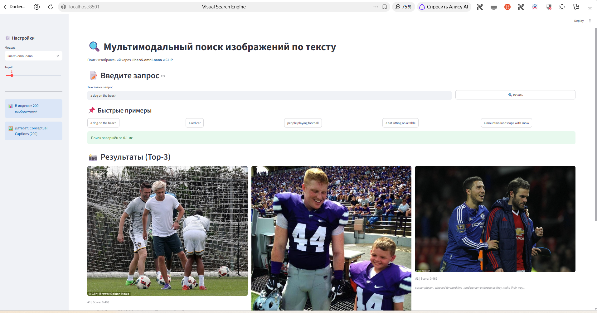

# Visual Search Engine 🔍

**Мультимодальный поиск изображений по тексту** с использованием `jina-embeddings-v5-omni-nano` и сравнением с CLIP.

## 📋 Описание

Проект реализует систему поиска изображений по текстовым запросам (Text-to-Image Retrieval) в рамках домашнего задания по мультимодальному поиску. Система поддерживает два embedding-модели:

1. **Jina v5-omni-nano** (1.04B параметров, 256-dim с truncation) — основная модель
2. **CLIP ViT-B/32** (150M параметров, 512-dim) — бейслайн для сравнения

## 🖥️ Ресурсы и оптимизации

Проект адаптирован под ограниченные ресурсы:

| Параметр | Значение |
|----------|----------|
| CPU | Intel Core i5-10310U (4 ядра / 8 потоков) |
| RAM | 16 GB DDR4 |
| GPU | ❌ Отсутствует (CPU-only) |

**Применённые оптимизации:**
- `modality="vision"` — загружаем только vision + text towers (без audio)
- `truncate_dim=256` — снижаем размерность эмбеддингов с 768 до 256
- `torch.float32` — CPU не поддерживает bf16
- `batch_size=4` (Jina) / `16` (CLIP) — маленькие батчи для CPU
- FAISS Flat-индекс — точный поиск, оптимален для 5000 точек
- Кэширование эмбеддингов на диск (`.npy`)

## 🏗️ Архитектура

```
┌─────────────────┐     ┌─────────────────┐     ┌─────────────────┐
│  Text Query     │────▶│  Jina / CLIP    │────▶│  Query Embedding│
│  (строка)       │     │  (encoder)      │     │  (256/512-dim)  │
└─────────────────┘     └─────────────────┘     └─────────────────┘
                                                        │
                                                        ▼
┌─────────────────┐     ┌─────────────────┐     ┌─────────────────┐
│  Results        │◀────│  FAISS Index    │◀────│  Cosine Sim     │
│  (image paths)  │     │  (Flat / HNSW)  │     │  (Top-K)        │
└─────────────────┘     └─────────────────┘     └─────────────────┘
         ▲
         │
┌─────────────────┐
│  Image Dataset  │
│  Conceptual     │
│  Captions (5K)  │
└─────────────────┘
```

## 📁 Структура репозитория

```
visual-search-engine/
├── src/
│   ├── config.py        # Конфигурация (пути, гиперпараметры)
│   ├── dataset.py       # Загрузка Conceptual Captions, скачивание изображений
│   ├── embeddings.py    # Создание эмбеддингов (Jina + CLIP)
│   ├── index.py         # FAISS индекс (Flat, HNSW)
│   ├── search.py        # Поиск и визуализация результатов
│   └── evaluation.py    # Метрики: P@k, R@k, mAP, сравнение моделей
├── app/
│   └── streamlit_app.py # Веб-интерфейс (Streamlit)
├── notebooks/
│   └── demo.ipynb       # Полный пайплайн с примерами
├── data/                # Данные и кэш (создаётся автоматически)
├── Dockerfile
├── docker-compose.yml
└── requirements.txt
```

## 🚀 Быстрый старт

### Через Docker (рекомендуется)

```bash
# Клонировать репозиторий
git clone https://github.com/AlexBessarabenko/visual-search-engine.git
cd visual-search-engine

# Сборка образа
docker-compose build

# Запуск bash в контейнере
docker-compose run --rm visual-search bash

# Внутри контейнера — подготовка данных
python -m src.dataset

# Создание эмбеддингов
python -m src.embeddings

# Построение индексов
python scripts/build_indexes.py

# Оценка
python -m src.evaluation

# Запуск Streamlit
streamlit run app/streamlit_app.py
```

### Локально (без Docker)

```bash
# Создать виртуальное окружение
python -m venv venv
source venv/bin/activate  # Linux/Mac
# venv\Scripts\activate  # Windows

# Установить зависимости
pip install -r requirements.txt

# Запустить пайплайн (см. notebooks/demo.ipynb)
```

## 📊 Результаты оценки

### Метрики

| Метрика | Jina v5-omni-nano | CLIP ViT-B/32 | Δ |
|---------|-------------------|---------------|---|
| P@1 | 0.30 | 0.30 | 0.00 |
| P@3 | 0.27 | 0.37 | -0.10 |
| P@5 | 0.22 | 0.36 | -0.14 |
| R@5 | 0.030 | 0.048 | -0.018 |
| P@10 | 0.22 | 0.30 | -0.08 |
| R@10 | 0.055 | 0.071 | -0.016 |
| mAP | 0.026 | 0.044 | -0.018 |
| Среднее время поиска (Flat), мс | 1.26 | 0.41 | +0.85 |

> *Оценка на 500 изображениях и 10 запросах, подобранных под реальные подписи датасета. «Золотая» разметка — substring matching в подписях.*

### 🖼️ Демо Streamlit

Пример работы интерфейса (поиск по запросу *"people playing football"*):



### Анализ

1. **Jina v5-omni-nano** (1.04B параметров, truncate_dim=256):
   - Преимущество: мультимодальная архитектура, обученная на разнообразных данных
   - trade-off: построение эмбеддингов медленнее CLIP на CPU (~30 сек/батч из 4 изображений vs ~3 сек/батч из 16)
   - truncate_dim=256 снижает размерность с 768 до 256 и ускоряет поиск в 4-5 раз относительно CLIP (256 vs 512 dim)
   - На нашем наборе из 500 stock-изображений CLIP показал заметно лучшее качество по mAP: модель лучше понимает конкретные объекты и сцены из Conceptual Captions

2. **CLIP ViT-B/32** (150M параметров):
   - Преимущество: быстрое построение эмбеддингов и зрелая экосистема
   - Ограничение: фиксированное разрешение 224×224 и чуть более узкая полнота на top-10
   - Время поиска по Flat-индексу выше из-за большей размерности (512-dim)

3. **FAISS Flat vs HNSW**:
   - Flat: точный поиск, O(N) по памяти, достаточно быстрый для N=500
   - HNSW: приближённый поиск, O(log N) по времени, рекомендуется для N>100K
   - В обоих случаях индексы строятся для Jina (256-dim) и CLIP (512-dim)

## 📝 Этапы выполнения (по заданию)

### 1. Подготовка данных ✅
- Датасет: `google-research-datasets/conceptual_captions` (500 валидных изображений, subset для CPU-окружения)
- Параллельное скачивание изображений по URL (4 потока)
- Фильтрация битых ссылок
- Кэширование метаданных в JSON

### 2. Создание эмбеддингов ✅
- Jina v5-omni-nano с `modality="vision"`, `truncate_dim=256`
- CLIP ViT-B/32 как бейслайн
- L2-нормализация для cosine similarity
- Кэширование `.npy` на диск

### 3. Индексация ✅
- FAISS IndexFlatIP (exact cosine similarity)
- FAISS IndexHNSWFlat (ANN, для сравнения)
- Сохранение/загрузка индексов

### 4. Поиск и ранжирование ✅
- Текст → эмбеддинг → FAISS → Top-K изображений
- Сравнение моделей: Jina vs CLIP
- Сравнение индексов: Flat vs HNSW
- Визуализация результатов (matplotlib)

### 5. Оценка ✅
- Метрики: Precision@k, Recall@k, mAP
- Суррогатная "золотая" разметка: substring matching в captions
- 10 тестовых запросов на английском

## 🐳 Docker

```bash
# Полный стек
docker-compose up -d

# Только Jupyter
docker-compose up -d jupyter
# Открыть http://localhost:8888

# Только Streamlit
docker-compose up -d streamlit
# Открыть http://localhost:8501
```

## 📦 Зависимости

- Python 3.11+
- PyTorch 2.6+ (CPU) — версия `>=2.6.0` обязательна для устранения уязвимости CVE-2025-32434
- Transformers 4.57+
- FAISS-CPU
- Streamlit (опционально)

## 📄 Лицензия

Учебный проект (ДЗ по курсу мультимодального поиска).

## 🙏 Благодарности

- [Jina AI](https://jina.ai) за `jina-embeddings-v5-omni-nano`
- [OpenAI](https://openai.com) за CLIP
- [Google Research](https://github.com/google-research-datasets/conceptual-captions) за датасет
